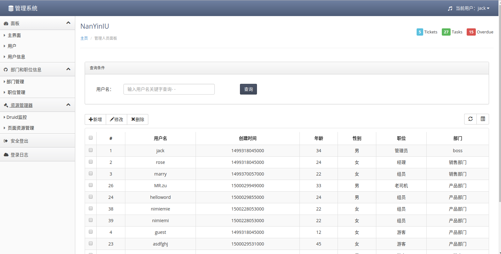
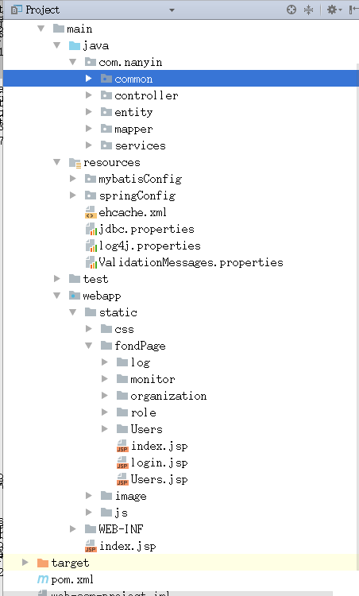
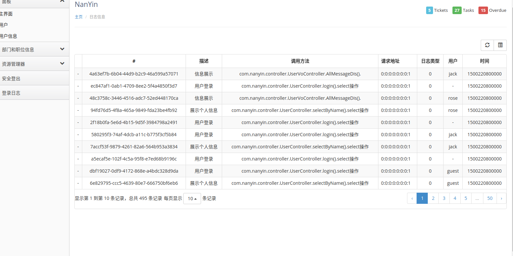

# ssm-web-project
# 项目介绍
基于spring,springMVC,mybatis，shiro开发的权限管理系统
#### 后端技术:
技术 | 名称 | 官网
----|------|----
Spring Framework | 容器  | [http://projects.spring.io/spring-framework/](http://projects.spring.io/spring-framework/)
SpringMVC | MVC框架  | [http://docs.spring.io/spring/docs/current/spring-framework-reference/htmlsingle/#mvc](http://docs.spring.io/spring/docs/current/spring-framework-reference/htmlsingle/#mvc)
Apache Shiro | 安全框架  | [http://shiro.apache.org/](http://shiro.apache.org/)
MyBatis | ORM框架  | [http://www.mybatis.org/mybatis-3/zh/index.html](http://www.mybatis.org/mybatis-3/zh/index.html)
MyBatis Generator | 代码生成  | [http://www.mybatis.org/generator/index.html](http://www.mybatis.org/generator/index.html)
Druid | 数据库连接池  | [https://github.com/alibaba/druid](https://github.com/alibaba/druid)
hibernate-validator | 校验框架  | [http://hibernate.org/validator]
Ehcache | 进程内缓存框架  | [http://www.ehcache.org/](http://www.ehcache.org/)
Log4J | 日志组件  | [http://logging.apache.org/log4j/1.2/](http://logging.apache.org/log4j/1.2/)
Maven | 项目构建管理  | [http://maven.apache.org/](http://maven.apache.org/)
#### 前端技术:
技术 | 名称 | 官网
----|------|----
jQuery | 函式库  | [http://jquery.com/](http://jquery.com/)
Bootstrap | 前端框架  | [http://getbootstrap.com/](http://getbootstrap.com/)
Bootstrap-table | Bootstrap数据表格  | [http://bootstrap-table.wenzhixin.net.cn/](http://bootstrap-table.wenzhixin.net.cn/)
Font-awesome | 字体图标  | [http://fontawesome.io/](http://fontawesome.io/)
bootstrapValidator | 前端验证框架 | [https://github.com/1000hz/bootstrap-validator]
JQuery Toastr|前端消息通知插件|[http://thevectorlab.net/flatlab/toastr.html]
zTree | 树插件  | [http://www.treejs.cn/v3/](http://www.treejs.cn/v3/)

### 开发环境
-系统:ubuntu17
-IDE:intellJ IDEA
-数据库:Mysql
-应用服务器:tomcat
-数据库客户端:DBeaver
-jdk版本:jdk8

### 预览图
#### 登录

#### 界面

#### 结构

#### 部门

#### 个人日程

#### 日志

